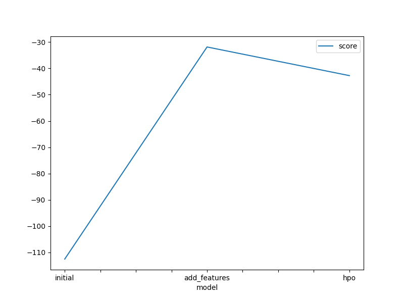
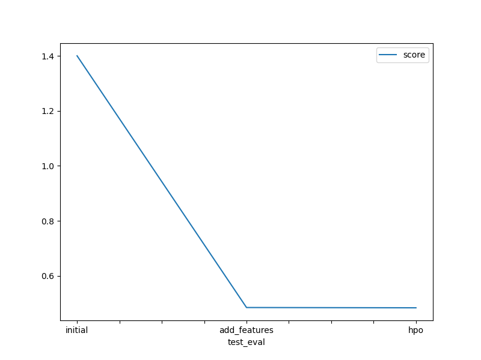

# Predict Bike Sharing Demand with AutoGluon

## Project Title
Bike Sharing Demand Forecasting using AutoML (AutoGluon)

## Project Description
This project tackles a real-world regression problem: predicting the hourly demand for a bike-sharing service based on weather conditions, time of day, and calendar features. It was completed as part of the Udacity Machine Learning Engineer Nanodegree and submitted to the [Kaggle Bike Sharing Demand competition](https://www.kaggle.com/c/bike-sharing-demand).

The project demonstrates an end-to-end ML workflow — from exploratory data analysis and feature engineering to model training, hyperparameter optimization, and iterative improvement tracked through Kaggle leaderboard scores.

## Problem Statement
Bike-sharing companies need accurate demand forecasts to efficiently allocate bikes across stations. Given historical records of rentals alongside weather and datetime metadata, the goal is to predict the total number of bike rentals (`count`) for each hour.

This is a supervised regression task evaluated using **Root Mean Squared Error (RMSE)**.

## Problem Solving Method

### 1. Baseline Model
AutoGluon's `TabularPredictor` was trained on the raw dataset with the `best_quality` preset and a 10-minute time limit. The `casual` and `registered` columns were dropped since they are absent from the test set and would cause data leakage. Negative predictions were clipped to zero before submission.

**Kaggle RMSE: 1.400**

### 2. Feature Engineering
Exploratory data analysis revealed that the `hour` feature has a strong correlation (0.40) with bike demand — peak usage occurs during morning and evening commute hours. Three new features were extracted from the `datetime` column:
- `hour` — hour of the day
- `day` — day of the month
- `month` — month of the year

Additionally, `season` and `weather` were cast to `category` dtype so AutoGluon treats them as categorical rather than numeric variables.

**Kaggle RMSE: 0.486** — a 65% improvement over the baseline.

### 3. Hyperparameter Optimization (HPO)
Three model families were tuned manually and passed to AutoGluon:

| Model | Hyperparameter | Value |
|-------|---------------|-------|
| GBM (LightGBM) | `max_depth` | 8 |
| GBM (LightGBM) | `n_estimators` | 80 |
| GBM (LightGBM) | `learning_rate` | 0.01 |
| XGBoost | `n_estimators` | 110 |
| XGBoost | `max_depth` | 10 |
| XGBoost | `learning_rate` | 0.01 |
| Random Forest | `n_estimators` | 95 |
| Random Forest | `max_depth` | 9 |

**Kaggle RMSE: 0.484** — a marginal gain, confirming that AutoGluon's defaults are already well-calibrated.

### Score Progression

| Run | Description | Kaggle RMSE |
|-----|-------------|-------------|
| 1 | Initial model (raw features) | 1.400 |
| 2 | Added time-based features + category dtypes | 0.486 |
| 3 | Hyperparameter tuning (GBM, XGB, RF) | 0.484 |

## Tech Stack
- **Python** — pandas, NumPy, Matplotlib
- **AutoGluon** — AutoML framework (ensemble of GBM, XGBoost, Random Forest, Neural Networks, and others)
- **Kaggle API** — dataset download and submission

## Conclusion
Feature engineering delivered the largest performance gain in this project, reducing RMSE by 65% through extracting time-based signals from the datetime column. Hyperparameter tuning provided only a marginal additional improvement, which reflects AutoGluon's strength as an AutoML solution — its internal optimization already produces near-optimal model configurations. Given more time, further feature engineering (e.g., lag features, rolling averages, or weather interaction terms) would likely yield greater gains than additional hyperparameter search.
